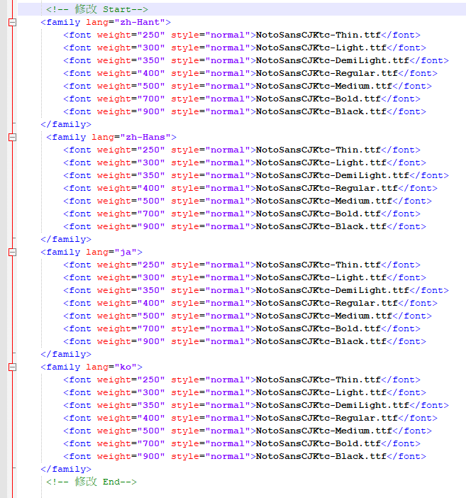
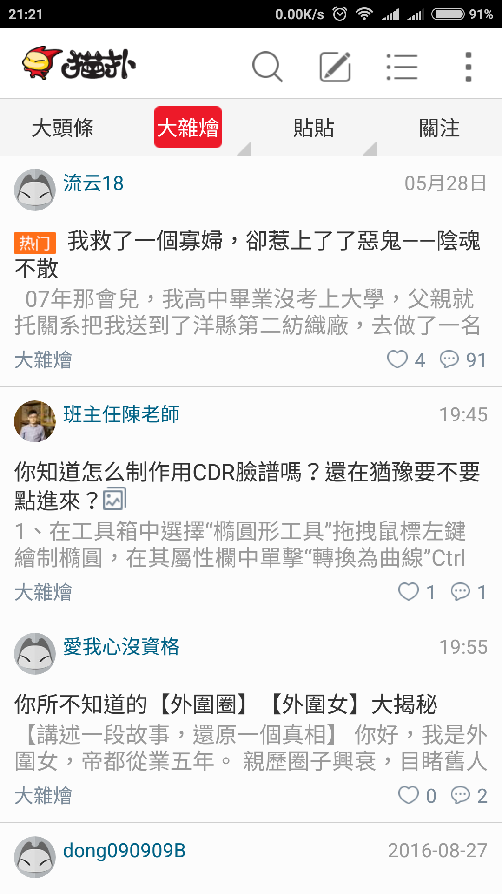
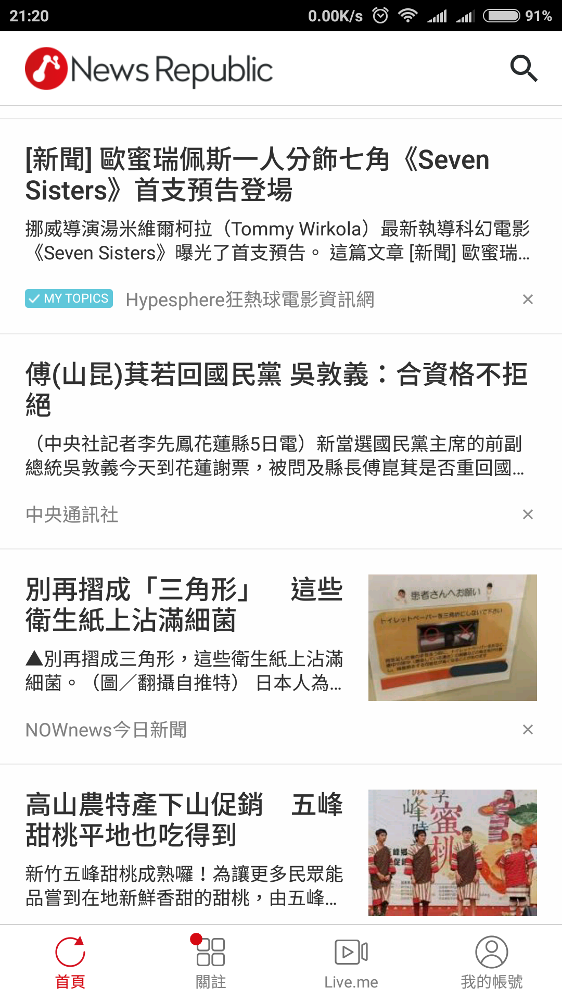

# NotoSansCJKTC_hans2hant
Backup of https://www.ptt.cc/bbs/Android/M.1496671955.A.543.html

# [[推薦] NotoSansCJKTC思源黑體 多字重 簡轉繁](https://www.ptt.cc/bbs/Android/M.1496671955.A.543.html) 作者: Adoltw (阿特魯)  
原始字體來源: Google Noto Fonts  
字型的說明 可以參考 或自行google 查詢  
適合長時間使用閱讀的 眼睛會較為舒服  
 
另外看不到  
網址內 http://emojipedia.org/unicode-8.0/  
這些Emoji符號的  
 
請去下載新的 Noto Color Emoji 字型檔案更換  
網址: https://www.google.com/get/noto/help/emoji/  
 
Noto Sans CJK TC  截取裡面的各種字重字體制作簡轉繁  
修改的部份有  
1.中文字型 簡體字部份對應為正體字.  
 
檔案下載: http://www.mediafire.com/file/r6rzktu9trkxp0x/NotoSansCJKtc_CHS2CHT_V.05.6.ZIP  
檔案短網址: https://tinyurl.com/ybc9j3pg  
MD5SUM: 620fb09f902ab9aadd2053f27cc1cf9f  
## NotoSansCJKtc_CHS2CHT_V.05.6.ZIP
> 壓縮檔內容:  
> -- \紅米note4\fonts.xml (紅米note4 miui 8.2 適用的fonts.xml)  
> -- \NotoSansCJKtc-Bold.ttf  
> -- \NotoSansCJKtc-DemiLight.ttf  
> -- \NotoSansCJKtc-Light.ttf  
> -- \NotoSansCJKtc-Medium.ttf  
> -- \NotoSansCJKtc-Regular.ttf  
> -- \NotoSansCJKtc-Thin.ttf  
>  
> -- \NotoSansMonoCJKtc-Bold.ttf    (Mono字型用 不用複製進去)  
> -- \NotoSansMonoCJKtc-Regular.ttf (Mono字型用 不用複製進去)  
## 使用方法 以下兩種方法 選一種.
第二種方法 多重字重 比較美一些  
服用前請先備份你原有的手機字型等設定.發生意外無法幫到你  
壓縮檔案內的字型及fonts.xml 放入手機系統的權限 皆要修改為644, 三讀一寫  
### 方法1
請先備份好自己舊有字型.及自行 google了解如何替換字型..  
字型檔案較大.更改成跟你裡面顯示的中文字型檔案名一樣.覆蓋  
請注意自己/system/fonts是否可以放置進去  
### 方法2
(1) 將壓縮檔內的字型.除了Mono字型以外的,  
都放進去你的手機 /system/fonts/  
全放進去要約 116mb,若你裡面空間沒那樣大,可以選擇  
看要放幾個字型放進去.  
這是字的粗細大小順序 ,由小至大.  
Thin - Light- DemiLight- Regular- Medium- Bold  - Black  
 
(2) 修改 /system/etc/fonts.xml  
增加插入類似以下圖片內容,圖片編輯器有顏色較容易看  
詳細可以google看看如何修改  

 
或是看一下壓縮檔內的fonts.xml 但不要用這個去覆蓋到你手機 
不見得合用於你的手機系統. 
 
family lang= xxxx  
簡易說明一些 指的是該語系字型顯示設定相關  
zh-hant 繁體  
zh-hans 簡體  
ja      日文  
ko      韓文  
 
**wegight 是字型的大小,後面指定用那個字型檔案顯示**  
## 顯示預覽 此為將所有字型檔案塞進去裡面

